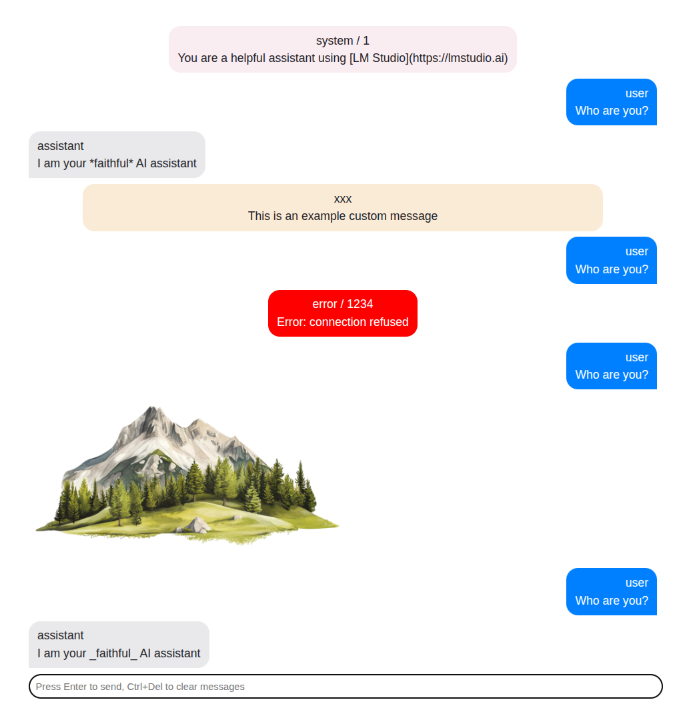

# Chat user interface for Vue.js

This package implements a simple chat interface for reuse in many projects where
a chat is required.



It was created during my study of AI capabilities and since I was creating the same thing
over and over again I decided to extract it as a separate package.

## Usage

To install the package issue the following command:

```bash
$ npm install --save-dev @padcom/chat-ui
```

Then in your application add the following:

```vue
<template>
  <Chat class="chat">
    <Messages :messages />
    <Prompt placeholder="Press Enter to send" @query="ask" />
  </Chat>
</template>

<script lang="ts" setup>
import { ref } from 'vue'
import { Messages, Prompt type ChatMessage } from '@padcom/chat-ui'

const messages = ref<ChatMessage[]>([
  { id: '1', role: 'system', content: 'You are a helpful and friendly AI assistant' },
  { id: '2', role: 'user', content: 'What is the meaning of life?' },
  { id: '3', role: 'assistant': content: '42' },
])

function ask(question: string) {
  messages.value.push({ id: '4', role: 'user', content: question })
}
</script>

<style>
@import "@padcom/chat-ui/dist/index.css";
</style>
```

If you want to center the chat on the screen add the following styles:

```vue
<style>
/* make sure the body covers the entire visible viewport */
html, body {
  margin: 0;
  padding: 0;
  width: 100dvw;
  height: 100dvh;
}
</style>

<style scoped>
/* control the max width and position */
.chat {
  max-width: clamp(400px, 50%, 50%);
  margin-inline: auto;
}
</style>
```

## Customization

There is a number of ways you can customize the chat. Pretty much every aspect of the
user interface is customizable.

### Custom message

To use a custom message display use the `default` slot of `Messages`:

```vue
<template>
  <Chat class="chat">
    <Messages v-slot="{ message }" :messages>
      <div class="my-message">{{ message.content }}</div>
    </Messages>
    <Prompt placeholder="Press Enter to send" @query="ask" />
  </Chat>
</template>
```

Sometimes all you will want is to add some styling to the message. For example,
to add [github-markdown-css](https://npmjs.com/package/github-markdown-css).
In those cases you can reuse the `Message` component exposed from the library:

```vue
<template>
  <Chat class="chat">
    <Messages v-slot="{ message }" :messages>
      <Message :message class="markdown-body" />
    </Messages>
    <Prompt placeholder="Press Enter to send" @query="ask" />
  </Chat>
</template>

<script lang="ts" setup>
import { ref } from 'vue'
import { Messages, Message, Prompt type ChatMessage } from '@padcom/chat-ui'

...
</script>

<style>
@import "github-markdown-css";
@import "@padcom/chat-ui/dist/index.css";
</style>
```

Finally, you might want to customize the message displayed while the `content` of the
message is empty. By default a `...` is displayed but you can override it using the default
slot of the `Message`, like so:

```vue
<template>
  <Chat class="chat">
    <Messages v-slot="{ message }" :messages>
      <Message :message>
        Waiting for response...
      </Message>
    </Messages>
    <Prompt placeholder="Press Enter to send" @query="ask" />
  </Chat>
</template>
```

### Customizing prompt

The `Prompt` component allows for a number of customizations. There are 3 slots in total and all
receive the function `ask()` and the current `question` as scope variables.

#### `left` and `right` slots

These slots are to the left and to the right of the input.

#### `default` slots

This slot by default renders the input. You can use it to for example render a completely different
component for the prompt while retaining the layout. However, if you're going this way you probably
don't want to use the `Prompt` component at all and you want something custom-made.

### Extending `ChatMessage` type

The `ChatMessage` interface is very sparse. Sometimes you might want to include additional information
about the message for custom display.

You can add any property to your messages - the `ChatMessage` implements indexed properties. However,...

The `messages` property of `Messages` component as well as `message` property of `Message` component
accept interfaces extended from ChatMessage:

```vue
<template>
  <Chat class="chat">
    <Messages v-slot="{ message }" :messages>
      <Message :message class="markdown-body">
        {{ message.extra }}
      </Message>
    </Messages>
    <Prompt placeholder="Press Enter to send" @query="ask" />
  </Chat>
</template>

<script lang="ts">
import { ref } from 'vue'
import { Chat, Messages, Message, Prompt, type ChatMessage } from '.'

interface Msg extends ChatMessage {
  extra?: string
}

const messages = ref<Msg[]>([])
</script>
```

In which case you'll get full code completion for your custom properties of messages:


### Further customizations

The component library will evolve over time. All customizations are usually tested in `App.vue`,
which is also the playground for me to work with the library.

## Message formatters

Usually the format of the message, when chatting with an LLM is [markdown](https://en.wikipedia.org/wiki/Markdown).
By default there is no preprocessing done on the `content` of a `Message` and so the text is displayed as-is.

To format the message use one of the available message formatters from npm.
For example to use the [marked](https://npmjs.com/package/marked) install it via npm:

```bash
$ npm install --save-dev @padcom/chat-ui-formatter-marked
```

It registers itself automatically so the only thing you need to do is to make sure it is imported:

```javascript
import '@padcom/chat-ui-formatter-marked'
```

### Custom message formatter

If you'd like to use a different package for formatting messages, or you'd like them to be presented
in a different way (e.g. to display messages in JSON format) you can register your own formatter:

```javascript
import { setChatMessageFormatter, type: ChatMessage } from '@padcom/chat-ui'

setChatMessageFormatter((message: ChatMessage) => JSON.stringify(message, null, 2))
```

## Credits

Colors and direction of messages have been ripped off from iPhone messages app.
